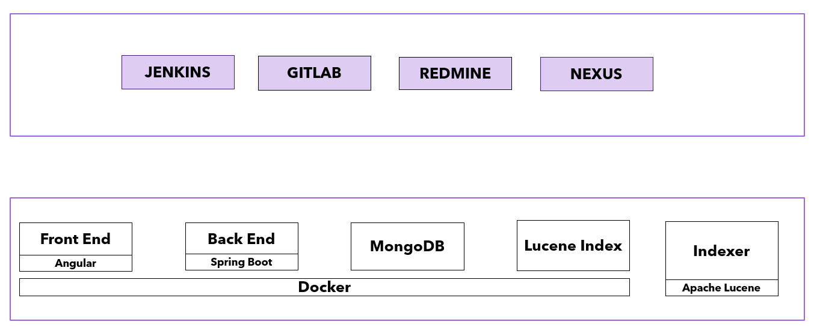
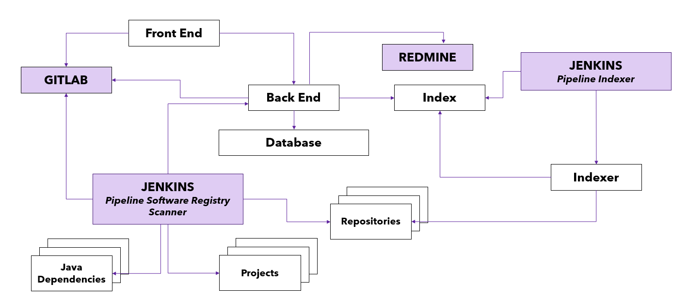

# Software Registry

## Description

*Software Registry* is a system that supports several software development aspects providing the following features:

- Automatic generation of a catalog of all software assets
- Persistence of areas / repositories / projects / dependencies hierarchy of Java projects
- Java project dependencies analysis and maven module relationships check
- Check for project dependencies updates
- Centralized search within software sources (Source Code Search Engine)
- Visualization of the updated software objects list in a development branch

## Use cases

- Software assets inventorying
- Creation of a centralized information access point about projects, dependencies and libraries
- Code search and analysis, also for support teams
- Impact analysis for software developments
- Software assets reporting
- Deployed software reporting and deployments history

## Application Components

- [Backend](./backend/README.md)
  - Application based on [Spring Boot](spring.io/projects/spring-boot)
  - Exposes REST APIs to be invoked by the Frontend

- [Frontend](./frontend/README.md)
  - Single Page Application based on [Angular](https://angular.io/)
  
- [Indexer](./indexer/README.md)
  - Source code indexer based on [Apache Lucene](https://lucene.apache.org/) e [Spring Boot](spring.io/projects/spring-boot)

- [Pipeline Jenkins](./iac/README.md)
  - Groovy Pipeline that pulls a list of git repositories, analyzes Java dependencies and produces plain output files
  
The following external components are also used:

- [MongoDB](https://www.mongodb.com/)
- [Apache Lucene](https://lucene.apache.org/)
- A valid LDAP server
- [Jenkins](https://www.jenkins.io/) (to run the pipelines)

*Software Registry* generates all the information using these external applications:

- [Gitlab](https://about.gitlab.com/)
- [Redmine](https://www.redmine.org/)

## Data load process

- *Software Registry Scanner Pipeline*:
  - Generates a repository list of all the groups using gitlab REST APIs
  - Checks out each repository, master branch
    - The repositories should have a tag specifying their technology (Java, Python, etc...)
  - For each Java project:
    - Loads all **maven modules** that are persisted later as Projects
    - Runs dependencies analysis: `mvn dependency:tree`
    - Creates the following files: repositories.json, dependencies.txt
  - Reloads database **MongoDB** objects invoking the APIs:
    - HTTP GET ${BACKEND URL}/project/reload
    - HTTP GET ${BACKEND URL}/repository/reload

- The "Indexer" project analyses source code downloaded by *Software Registry Scanner Pipeline*. So it should be ran after *Software Registry Scanner Pipeline*.

- The backend process accesses:
  - To Lucene Index
  - To MongoDB Database

